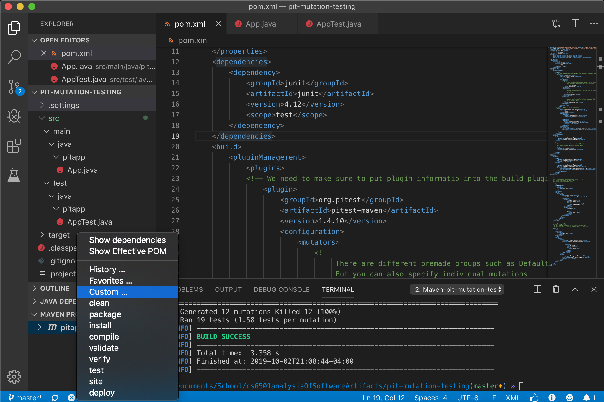
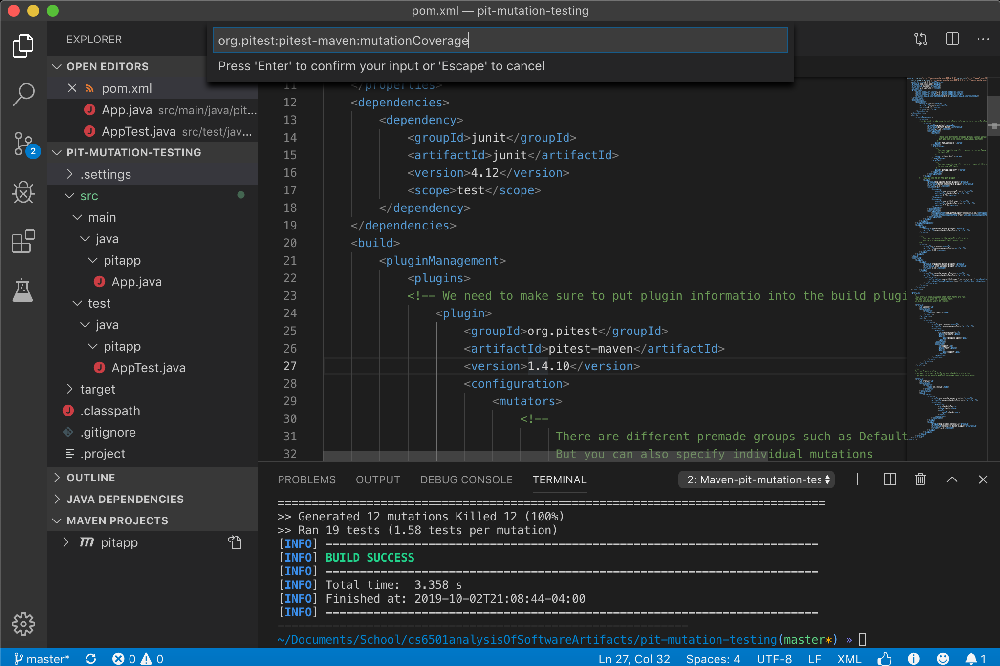
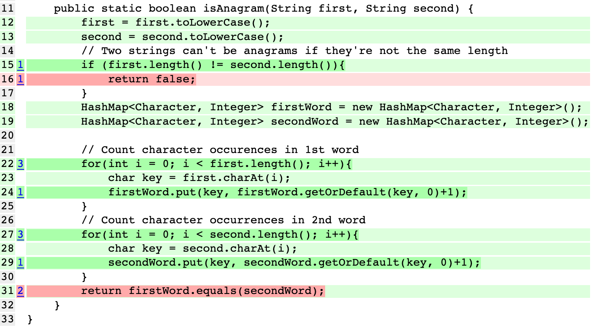
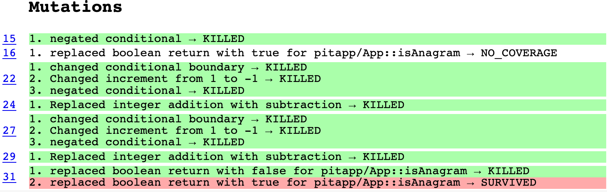
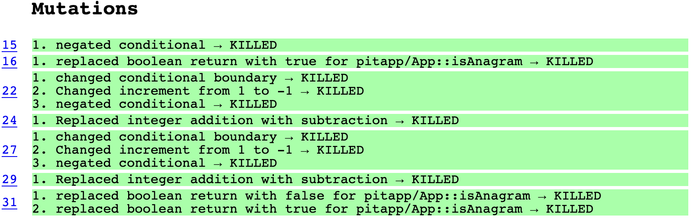

# pit-mutation-testing

A demo for a presentation about the [PIT testing tool](https://pitest.org/), prepared for CS 6501: Analysis of Software Artifacts and given on October 1st, 2019.  

The PIT Testing tool is a Java plugin that integrates with JUnit tests to allow for automatic mutation testing.  
The tool is compatible with the 3 major java package managers: Maven, Gradle, and Ant. However, you could also use command line, but this is not recommended. This is mostly because the commands get very long and unmanageable. You can find the Quickstart guide for the various package managers [here.](https://pitest.org/quickstart/)
For our demo we used the Maven Package manager because it integrates easily with VSCode. Download [Apache Maven](https://maven.apache.org/) here.  

## Running the Demo

We follow the instructions for [integrating PIT with a  Maven project](https://pitest.org/quickstart/maven/) found on the quickstart page of PIT’s main website. Fortunately, the only thing required to integrate the tool is to include the following in the `plugins` section of your `pom.xml` file:
```xml
<plugin>
    <groupId>org.pitest</groupId>
    <artifactId>pitest-maven</artifactId>
    <version>1.4.10</version>
 </plugin>
```
This the most basic version of the plugin and configurations can be passed to modify the functionality. For example, we included the `targetClasses`, `targetTests`, and `mutators` tags as they are some of the more commonly used configurations.

`targetClasses` and `targetTest` are configurations where you can pass parameters that specify which classes you would like to mutate and which tests to run those mutants against.    

`mutators` is probably the most useful configuration as it allows you to pick and choose from  individual mutations, premade mutation sets, or a combination of the two. The available sets and mutations along with the descriptions of those are available on [here](https://pitest.org/quickstart/mutators/). For the purpose of the demo we show the `NEW_DEFAULTS` set a starting place.

From here you just need to prepare the code and test cases to run the mutations tool on. We provide a sample class `App` that contains one function `isAnagram` that returns a boolean which is true if two words are anagrams and false otherwise. Two words are anagrams of each other if the contain the same combination of characters. We also initially provide only one weak test case that can be seen in `AppTest.java`. With this we are ready to begin testing! 


We can run mutation coverage on our maven project as-is with the following command:

``mvn org.pitest:pitest-maven:mutationCoverage``  

If this does not work, you can replace the call to `mvn` with the path to your installation of the maven executable. For example:  

``/examplePath/to/mavenInstallation/apache-maven-3.6.2/bin/mvn org.pitest:pitest-maven:mutationCoverage``

As a third option, you can use an IDE/text editor with built in maven support. For example, in the demo, we used Visual Studio Code, which allows you to run custom maven commands by right clicking on your application under the “Maven Projects” heading, and inputting a custom command, as shown below:  




If we run this command on the code as it is in the repository, the project will build and run PIT. We’ll notice that we get something similar to the following output:

```
>> Generated 12 mutations Killed 10 (83%)
>> Ran 11 tests (0.92 tests per mutation)
[INFO] ------------------------------------------------------------------------
[INFO] BUILD SUCCESS
[INFO] ------------------------------------------------------------------------
[INFO] Total time:  3.095 s
[INFO] Finished at: 2019-10-02T21:20:40-04:00
[INFO] ------------------------------------------------------------------------
```
Our mutators generated 12 mutations, but our test only killed 10 of them. There must be a problem with our test suite of 1 test (who would have guessed?). PIT automatically generates an HTML coverage report of this run in the `target/pit-reports` folder. These reports are in folders labelled by the date and time that you ran the coverage command with the format `YYYYMMDDHHMM`.

Inside the report folder, `index.html` will show us the statement and mutant coverage of our tests across all files tested. Additionally, PIT creates a folder for each package tested, along with coverage html files for each file tested. These files are split into 3 sections:
* A line-by-line report of the lines covered by our test suite. Every line from which a surviving mutant was generated is highlighted red.
* A **Mutations** section which contains the mutations generated for each line, as well as information on whether they were killed by our test suite, survived, or highlighted a line that contained no coverage in our test suite.
* A **Active Mutators** section which contains which kinds of mutators were applied to the code being tested.
* A **Tests Examined** section, which lists all test cases used in generating the report for this class.

For example, in our demo, `pitapp/App.java.html` has lines 16 and 31 highlighted in red, showcasing that our test suite does not have sufficient coverage for these two lines.



Specifically, the mutation generated for line 16 indicates that our test suite does not cover this line at all, and the surviving mutation at line 31 that replaces our `.equals()` call with a “true” value indicating that we do not have a test case that covers the path where we should return “false” from our method.



To fix this, we can uncomment the two tests in `AppTest.java` that are currently commented out (lines 18-25). These include a test where the two strings are not the same size, and a test where the two strings have the same size but are not anagrams. If we run the mutation coverage maven command again, we should get the following output:

```
>> Generated 12 mutations Killed 12 (100%)
>> Ran 19 tests (1.58 tests per mutation)
[INFO] ------------------------------------------------------------------------
[INFO] BUILD SUCCESS
[INFO] ------------------------------------------------------------------------
[INFO] Total time:  3.475 s
[INFO] Finished at: 2019-10-02T21:42:41-04:00
[INFO] ------------------------------------------------------------------------
```

When we check the new coverage report for `App.java.html` (generated in a new folder in `target/pit-reports`), we can see that all lines are now covered and all generated mutants are killed.



If you want to see more advanced mutants then you can go into the `pom.xml` file and change the `mutators` parameter from `NEW_DEFAULT` to `ALL`. 

## Extra Information

During class we discussed a few concepts about Mutation tools; we want to comment on how PIT in particular handles these situations.  

The first is how can the mutations be stored in a scalable way. PIt handles this by loading the compiled version of the program into memory and manipulating the byte code. However, if desired, the mutants can be written to files, in a separate directory to avoid deploying mutated code, allowing for future regression testing. The method of inserting mutants into the jvm has a two-fold benefit: first, it prevents us from needing to create a whole copy of the program for each mutant, and second, it allows for faster execution because no new class needs to be loaded.   

Additionally, the PIT testing tool performs two other methods to increase the execution speed. First, only tests that execute mutated code will be run on a particular mutant. Second, PIT tries to avoid creating mutants in static initializers or private methods only called from static initializers as this is likely very uninteresting code. Finally, the tests are ordered based on execution time, with the unit tests for a mutated class weighted higher than others. Tests are considered unit tests for a class if they are in a file that follows the JUnit naming convention for that class. For even more information check out the [FAQ page](https://pitest.org/faq/). 
 
## Interesting Questions 
* Couldn’t we perform static checking for mutations that change variables to null?
    * For some of the mutations we could, but since the mutants are created in memory it very well may be faster to simply run the relevant tests instead of attempting to build a dependency graph.  

* How do you know if a test covers a particular mutation?
    * The answer that I provided in class was that I believe that during the build process before mutation testing PIT would first run the tests to first acquire coverage information. Professor Elbaum added that for many tools mutations have access to previous coverage reports, since the mutations are run many times. The FAQ pages says “Per test case line coverage information is first gathered and all tests that do not exercise the mutated line of code are discarded.” Unfortunately, this is somewhat ambiguous. 

